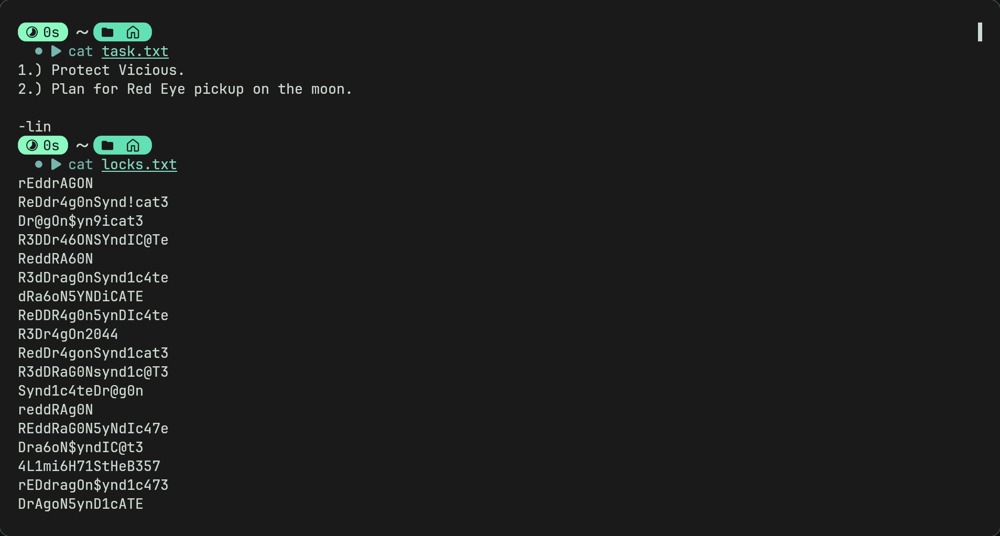

## [Bounty Hacker](https://tryhackme.com/room/cowboyhacker)
**Topics:** Enumeration, Scanning, PrivEsc

**Difficulty:** Easy

---
## 📝 Room Description
This is a very easy room, no unexpected twists just a straightforward challenge. May need a bit of research.

---
## 🔎 Enumeration
### Nmap
- First we run an nmap scan. I did `sudo nmap $ip -Pn -p- -T5 -sV -sC`
> `-p-` is to scan all ports, `-Pn` is to skip host discovery (assumes host is alive), `T5` increases scan speed, `sV` to scan port versions, `sC` runs default nmap scripts (i will explain why this is useful next)

- So we can see there is a ftp, ssh and a webserver.

### FTP
- By using `-sC` we can also see that anonymous login by ftp is allowed (very dangerous).
- This means we can log in using the username 'anonymous'
- And now were logged in. We can see 2 files (locks.txt and task.txt) that we can download using `get`

- Now looking at these files gives us some interesting information

- task.txt shows a email or message with the username lin (could possibly use this for bruteforce later?)
- locks.txt shows us something which resembles a wordlist

### SSH
- As we have a username, a wordlist, and the ssh port is open we can bruteforce using hydra
- `hydra -l lin -P locks.txt ssh://$ip -t 4 -f`
> -f stops the process after the password is found and -t 4 speeds it up.

- Now weve found the password we can log in to ssh.
 

> Tip: when logging into ssh if you cant use certain terms like clear use `export TERM=xterm` this allows you to use many commands like clear, vim, nano etc.

### PrivEsc
- We can use linpeas or any linux privesc binary to help us priv esc
- `sudo -l` tells us all the commands we can use with sudo without needing the root password, we can also find SUID bit set binaries with `find / -perm -u=s -type f`
- Using any of these we can find that /bin/tar can run with root permissions and we dont need root password to use it.
- We can use [GTFOBINS](https://gtfobins.github.io/#p) (website that helps with binary privesc) to escalate priv with the tar binary

- Now using the website we can use gtfobins and search up tar to give us commands we can use for privesc.

- You can use any command under shell to obtain a root shell. Remember to use sudo before it as it is a SUID binary and doesnt need root password
 

---

## Afterthoughts
- Overall very easy room, nice and straightforward.
- Only hard thing is maybe privilege escalation.
- I dont think there is another way to privilege escalate but not sure. I tried reading etc/shadow with tar but the hash has a salt which makes it very hard to crack.

---

### Questions or Issues
- Discord (ish24s)
- Email (ismaeelj888@gmail.com)
