##  [VulnNet: Internal](https://tryhackme.com/room/vulnnetinternal)

**Topics:** Enumeration, Scanning, Recon, Reverse-shell, PrivEsc

**Difficulty:** Easy

---

## 📝 Room Description
This is a room that highly focuses on internal networks/systems rather than more common areas like  web-applications. Most of the work will be done in the terminal instead of on a browser.

> Note: Research is your best friend.
> Especially for beginners, many of the tools and systems/applications in this room may be new to you so if something looks unfamiliar please take the time to do research before consulting writeups.

---

## 🔎 Enumeration
### Nmap
- First we run a basic nmap scan to see which ports are running. i used `sudo nmap -sC -sV -p- -Pn -T4 -O $ip --min-rate 1000 -oN vulnetnmap.txt`
> Tip - instead of having to type in your ip every time type `export ip=machineip` where machineip is the actual ip. this makes a variable called ip which you can call using $ip. therefore instead of typing ip again and again you can just use $ip as the ip.

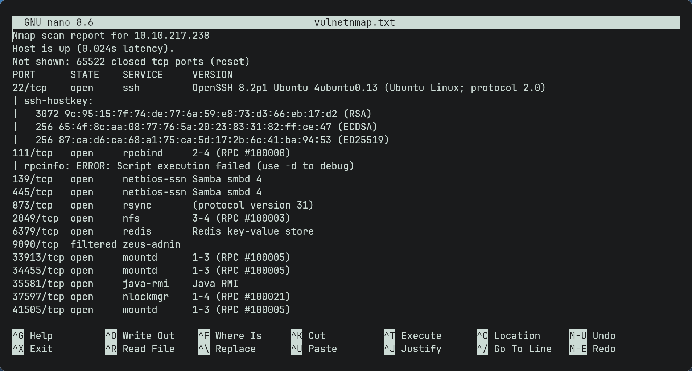

- As seen there are many ports since this is a network based ctf.
- Some well-known ones we can see are smb and ssh.
### SMB
- As we know smb is open we can enumerate for possible shares by using `smbclient -L //$ip -U` (since we dont know any usernames yet we dont put a username and leave it blank)
> Note: you could also use enum4linux to enumerate as it does the same thing but it goes into more detail)

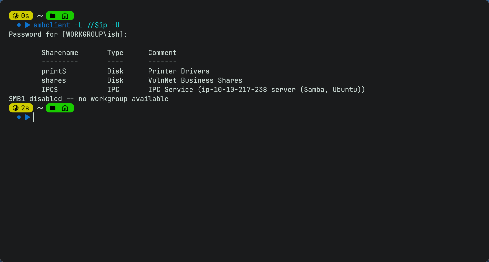

- So weve found 3 shares available. IPC$ is a administrative share in SMB and is used for things like remote management and communications between processes/services. Trying to connect to IPC$ is not allowed and we get the same error for trying to connect to print share.
- However we can connect to the shares share by doing `smbclient //$ip/shares -U`

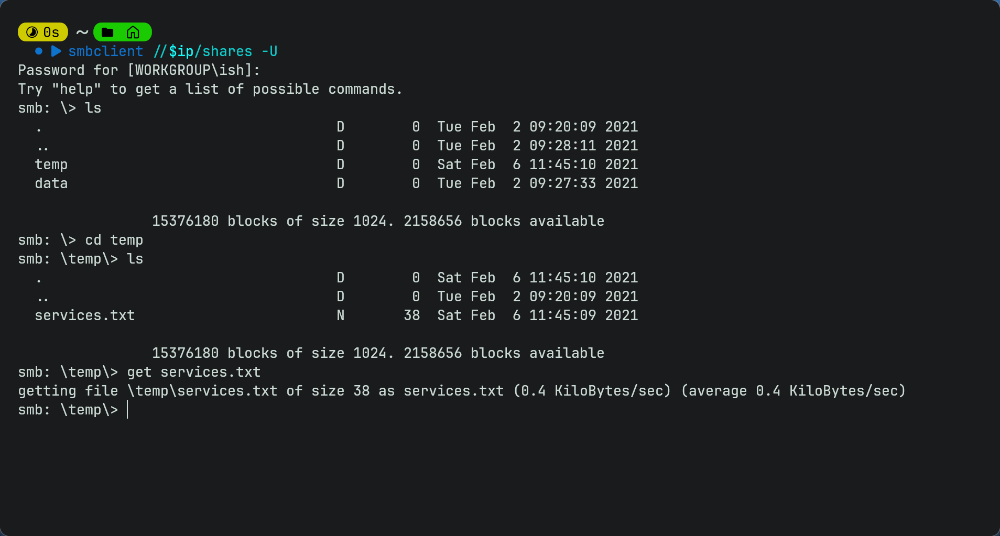

- As it is an smb share it has a few different commands so you will need to use get to download the txt file on your device then cat it on your terminal to get the 1st flag.
### Redis
- Redis is an in-memory key-value database and is often used for caching or storing small structured data like hashes, lists and sets.
- we can connect to it using `redis-cli -h $ip`
- However we cannot use any commands as it requires authentication
- We can try bruteforcing using hydra or nmap but it fails meaning bruteforcing is not the way.

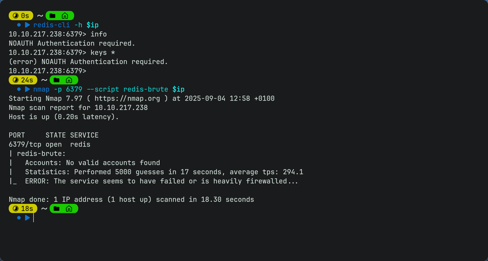

- since we have no info yet we will come back to this later
### NFS
- NFS is a protocol used for sharing files across a network.
- We can see if the target is sharing any directories using `showmount -e $ip`
- We can see it is sharing /opt/conf publicly. As it shows a * this means any ip address can mount it. It is available publicly.
- We can therefore create a mount point on our maching using `mkdir mnt`
- Then we can mount it to our machine using `sudo mount -t nfs $ip:/opt/conf mnt`
> Note: you can use any name for the directory you create i used mnt as its short and relatable. you would swap mnt here for the directory name you created
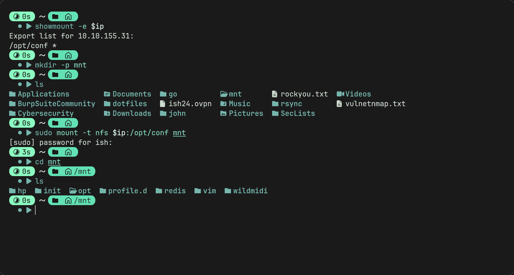

- We see a redis directory. Maybe it can help us get into the redis server?
- inside we find a redis.conf file. Reading it in nano we can see that there is a requirepass variable which means that anyone connecting to a redis server must authenticate with this password to be able to use commands. So we
have got the redis server password now.

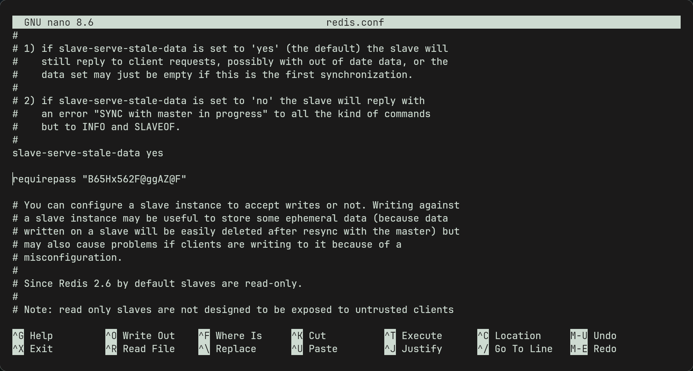

> Note: we can also use `cat redis.conf | grep requirepass` to find the password easier. we use the one that is uncommented.

- Now we can connect to redis again and use the command `AUTH B65Hx562F@ggAZ@F` and we can now use any command.
- If we use keys * we can find all the keys. from there we find "internal flag" key. we can use `get "internal flag"` to find the 2nd flag.
- By looking around we see that the authlist is a list of tokens by using `lrange authlist 0 -1`. This displays the contents of the authlist key from the start to the end.
- the contents show the same base64 encoded string which we can decode using your faviourite decoder (i used cyberchef) and we get a string which states that the password for rsync(another service) is "Hcg3HP67@TW@Bc72v"
### Rsync
- this service syncs files between 2 remote machines.
- to connect to rsync we need to create a folder called rsync to put the files inside.
- As rsync doesnt allow a singular password we should create a file called rsync.pass and paste the rsync password on top line.
- Then we connect to rsync using `rsync -avz --password-file=rsync.pass rsync://rsync-connect@$ip/files /home/ish/rsync/`
> Note: -a is archive mode which preserves perm, timestamps etc. -v is verbose and -z compresses data during transfer. not using these may result in a error.

- Now we go into rsync folder and we find 3 users. sys-internal looks interesting. we go into folder and find user.txt

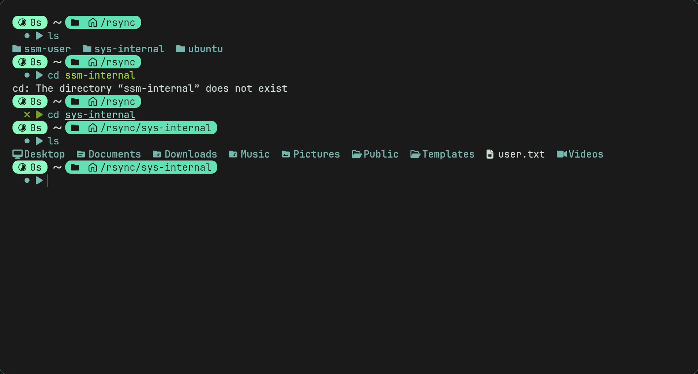

### SSH
- By looking at the files on sys-internal we can see a .ssh dotfile. It has read write and exec permissions which is very interesting.
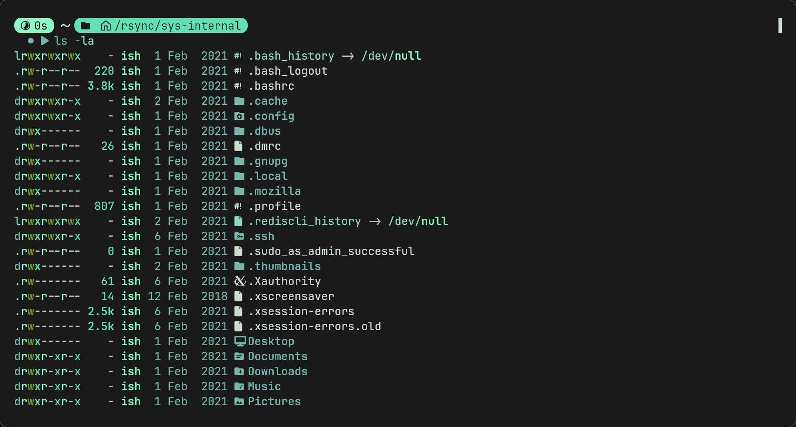

- We can generate an ssh keypair with `ssh-keygen -f ./id_rsa` (make sure to do this in your own directory not the rsync one.
- we can then upload the public key to the server using `rsync ./id_rsa.pub rsync://rsync-connect@$IP:873/files/sys-internal/.ssh/authorized_keys`
> Note: .ssh/authorized_keys is where servers store ssh public keys which are allowed to log in to the server.

- We can then ssh into the machine using the private key - `ssh -i id_rsa sys-internal@$ip` (this may not work as key doesnt have correct permissions due to OpenSSH's strict key permissions, if so use `chmod 600 id_rsa` then try again.)
- Now we have a shell.
### PrivEsc
- From here we could download linpeas or any linux privesc tools but going to root directory we can see a TeamCity directory
- TeamCity is a CI server and looking further with `ps aux` we can see its running on the target on port 8111.
- Looking around we find a readme.txt and we can see that on linux the server runs on localhost:8111 which is interesting.
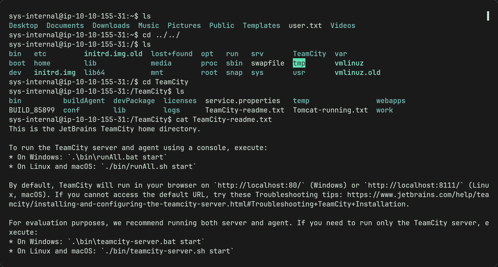

- since we cannot access it currently we can use something called ssh port forwarding to forward traffic through our machine to the targets localhost so we can open http://localhost:8111
- We can do this by closing the current connection and opening another using `ssh -i id_rsa sys-internal@$ip -L 8111:localhost:8111`
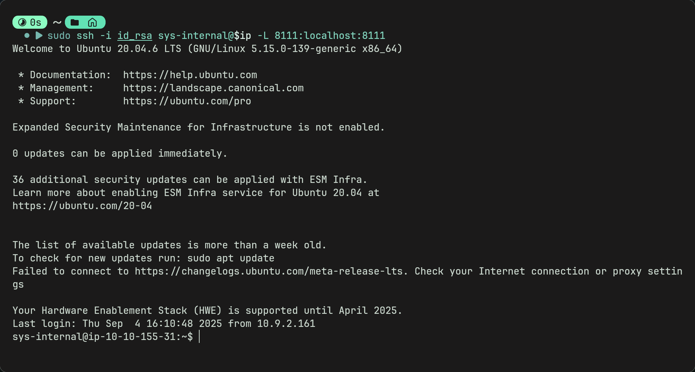

- Now we have a connection we can access the TeamCity login page with http://localhost:8111 on our own browser.
- We can see that there is a super user login which only requires a auth token.
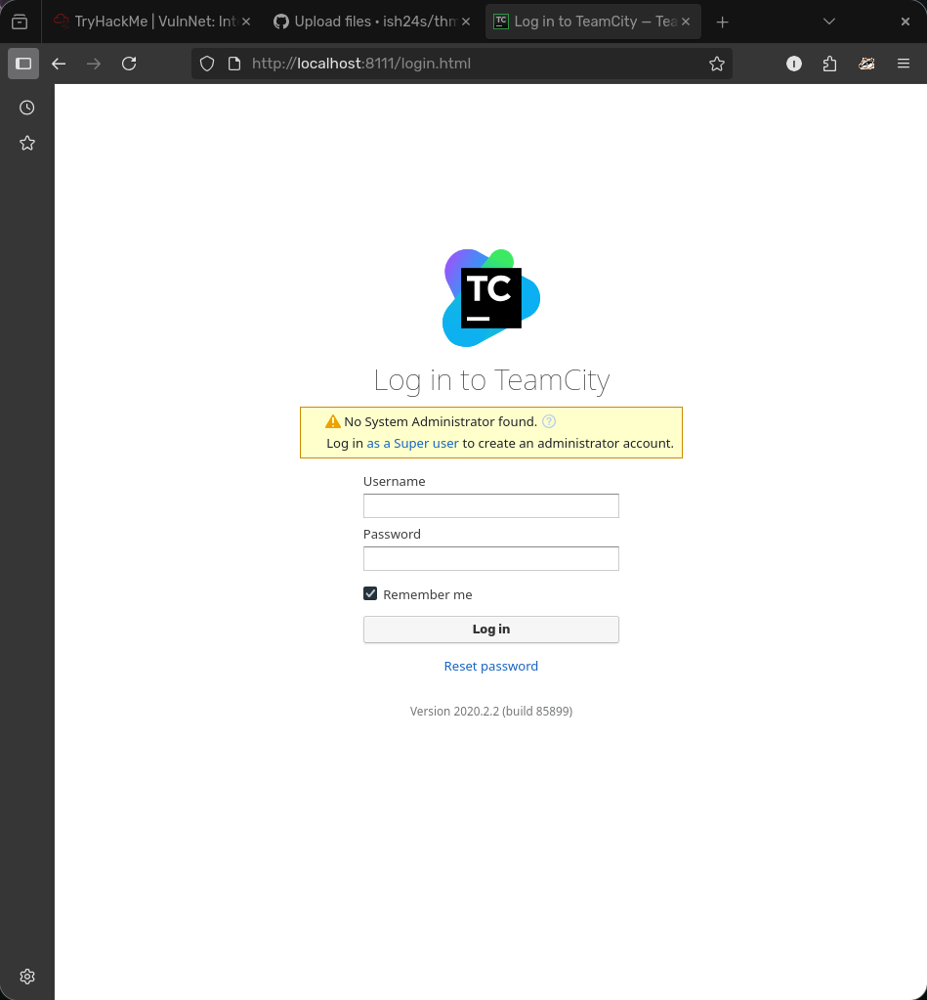

- We can go back to the ssh connection and look for tokens which may be hidden in config files etc.
- logs could potentially hold some valuable info. using `grep -r tokens logs/ 2>/dev/null` we find a bunch of auth tokens which relate to the superuser.
> Note: 2>/dev/null is used because it hides any errors related to permissions, just gives a cleaner output. can be used to find files aswell.

- Now we try each token till we log in.
-Then we create a project manually
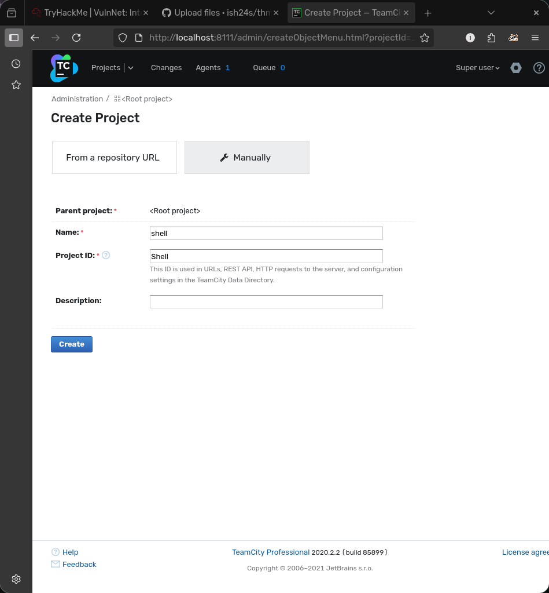

- Then create a build configuration and skip the VCS root step
- Then create a new build step and this is where you add your reverse shell.
- TeamCity supports a few languages that reverse shells work with but i chose python. Use a custom script and add your reverse shell there.
> Note: if using a python script there is no need to use python -c as the script will be executed as python anyway. so using it may break the script though i havent tested.

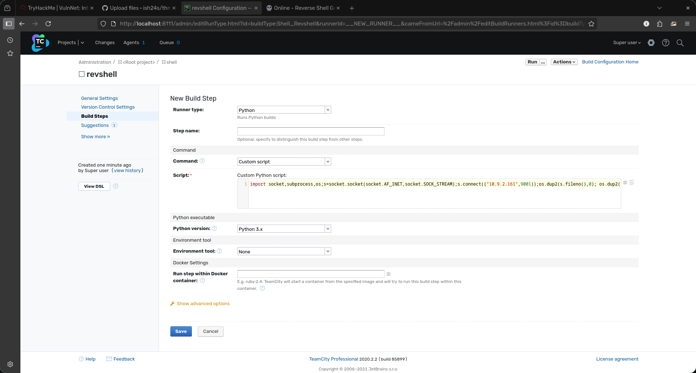

- Now run your listener
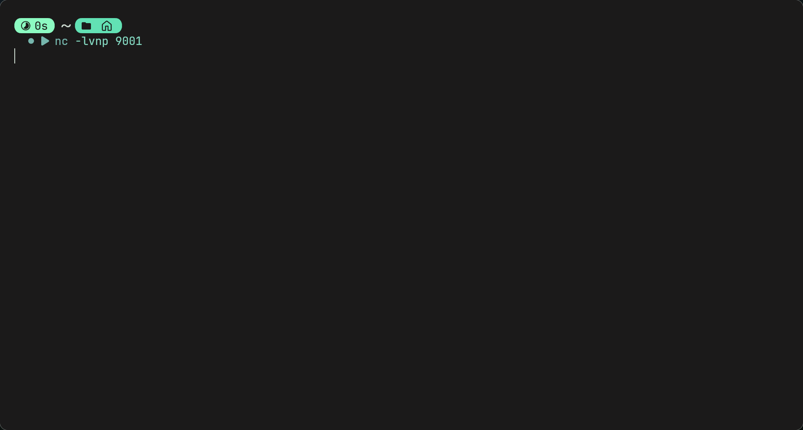

- And run the script at the top. Hopefully you should get a connection. Go to root directory to get the last flag.
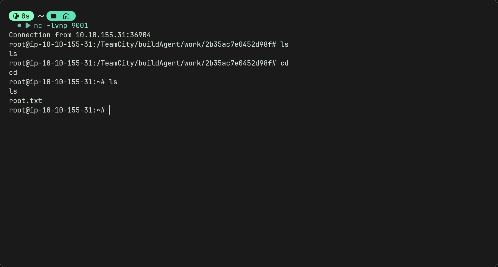

---

## Afterthoughts
- Dont think i would class this as easy as the privesc is a bit strange as i wouldve thought it would be all be done in the terminal.
- But overall theres a lot of experienced to be gained with this room such as exposure to new vulnerable services such as rsync, redis, smb and nfs.
- Again a lot of research is required in this room especially for beginners so dont worry if a lot of looking up was done.

---

### Questions or Issues
- Discord (ish24s)
- Email (ismaeelj888@gmail.com)
